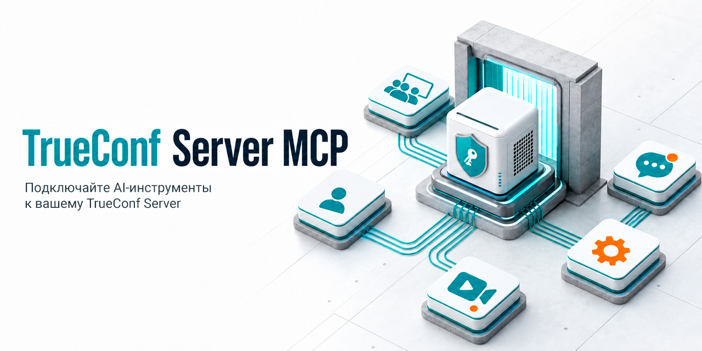
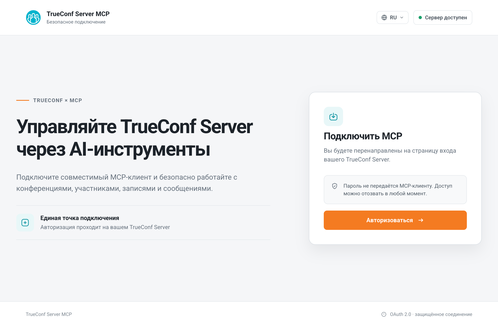
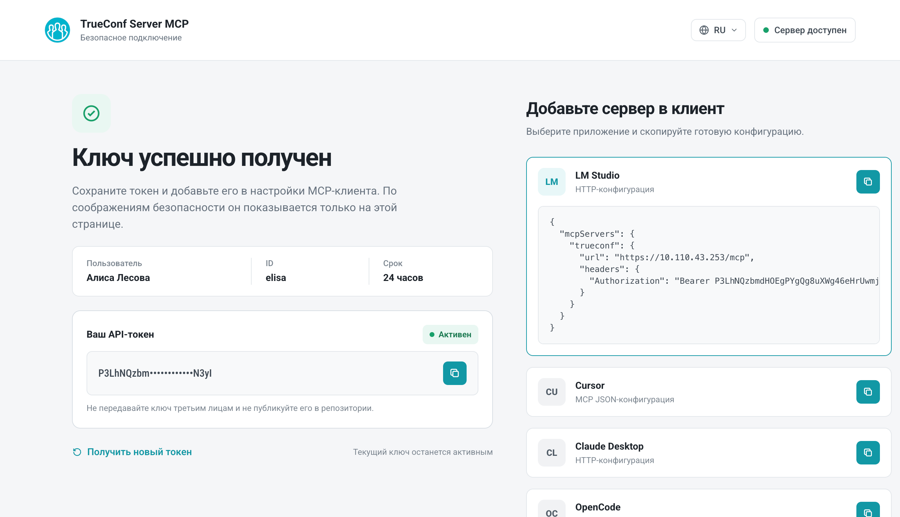

<p align="center">
  <a href="https://trueconf.ru" target="_blank" rel="noopener noreferrer">
    <picture>
      <source media="(prefers-color-scheme: dark)" srcset="https://raw.githubusercontent.com/TrueConf/.github/refs/heads/main/logos/logo-cyrillic-dark.svg">
      
    </picture>
  </a>
</p>

<h1 align="center">TrueConf Server MCP</h1>

<p align="center">Управляйте конференциями, записями и приглашениями TrueConf Server через любой MCP-клиент — LM Studio, Cursor, Claude Desktop и другие.</p>

<p align="center">
  <a href="https://pypi.org/project/trueconf-server-mcp" target="_blank">
    
  </a>
</p>

<p align="center">
  
</p>

<p align="center">
  <a href="README.md">English</a> /
  <a href="./README-ru.md">Русский</a>
</p>

> [!CAUTION]
> Данная инструкция применима к TrueConf Server версии 5.5.3 и выше.
> Если у вас установлена более старая версия, то [обновите сервер](https://trueconf.ru/products/server/howto-update-trueconf-server.html).

---

## Введение

[**Model Context Protocol (MCP)**](https://modelcontextprotocol.io) — открытый стандарт, который позволяет языковым моделям (LLM) напрямую вызывать внешние инструменты через единый протокол. Без MCP каждый LLM-клиент требовал бы собственной интеграции с API TrueConf Server. С MCP — один сервер экспонирует все инструменты, и любой поддерживающий MCP клиент сразу умеет ими пользоваться: создавать конференции, управлять приглашениями, просматривать записи и чаты.

**TrueConf Server MCP** — это промежуточный слой между LLM-клиентом и TrueConf Server. Он предоставляет 32 инструмента для работы с конференциями, записями, приглашениями, участниками, чатами, календарями, уведомлениями и переводами.

### Что умеет сервер

| Группа | Инструменты |
|---|---|
| **Конференции** | создание, редактирование, удаление, запуск, остановка, подключение |
| **Приглашения** | список, добавление, удаление, обновление, массовая рассылка |
| **Участники** | список участников, владелец, текущий пользователь |
| **Записи** | список, просмотр, запуск, остановка, пауза |
| **Ссылки и календари** | deeplinks, общие ссылки, ICS-файл, календари |
| **Уведомления и регистрация** | отправка уведомлений, регистрация на конференцию |

---

## Быстрый старт

1. **Установите** MCP-сервер. → [Шаг 1](#шаг-1--установка)
2. **Создайте OAuth-приложение** на TrueConf Server. → [Шаг 2](#шаг-2--создание-oauth-приложения)
3. **Запустите** MCP-сервер. → [Шаг 3](#шаг-3--запуск-сервера)
4. **Авторизуйтесь** и получите токен. → [Шаг 4](#шаг-4--авторизация)
5. **Подключите MCP-клиент** (LM Studio, Cursor и т.д.). → [Шаг 5](#шаг-5--подключение-mcp-клиента)
6. **Проверьте** работу. → [Шаг 6](#шаг-6--проверка)

### Шаг 1 — Установка

```bash
pip install trueconf-server-mcp
```

> [!TIP]
> Если у вас установлен [uv](https://docs.astral.sh/uv/), можно запустить сервер без установки — одной командой:
> ```bash
> uvx run trueconf-server-mcp --server 10.0.0.1 --client-id ... --client-secret ...
> ```

### Шаг 2 — Создание OAuth-приложения

Серверу нужен `client_id` и `client_secret` от OAuth-приложения на стороне TrueConf Server.

1. Откройте панель управления TrueConf Server → **Веб → Безопасность → OAuth 2.0**.
   Подробнее — в [документации](https://trueconf.ru/docs/server/ru/admin/api#create-oauth2-application).
2. Создайте новое приложение и укажите **redirect_uri**:

   ```
   http://localhost:8080/auth/callback
   ```

   > [!IMPORTANT]
   > Redirect URI должен совпадать с `MCP_BASE_URL` + `/auth/callback`. Если запускаете на другом порту или хосте — измените соответственно (см. [MCP_BASE_URL](#конфигурация)).

3. Отметьте **права (scopes)**, необходимые для работы инструментов:

   | Право | Описание |
   |---|---|
   | `conferences:read` | Чтение конференций, deeplinks, ссылок, календарей, переводов |
   | `conferences:write` | Создание, изменение, удаление, запуск, остановка, подключение |
   | `conferences.invitations:read` | Чтение приглашений |
   | `conferences.invitations:write` | Добавление, изменение, удаление, рассылка приглашений, уведомления, регистрация |
   | `conferences.participants:read` | Чтение участников, владельца, текущего пользователя |
   | `conferences.records:read` | Чтение записей |
   | `conferences.records:write` | Запуск, остановка, пауза записи |
   | `conferences.messages:read` | Чтение и экспорт сообщений чата |

4. Скопируйте `client_id` и `client_secret` — они понадобятся на следующем шаге.

### Шаг 3 — Запуск сервера

```bash
trueconf-server-mcp \
  --no-tls --port 8080 \
  --server 10.0.0.1 \
  --client-id <client_id> \
  --client-secret <client_secret>
```

Где:
- `--server` — IP-адрес или доменное имя TrueConf Server.
- `--client-id` и `--client-secret` — данные OAuth-приложения из шага 2.
- `--no-tls --port 8080` — запуск без TLS на порту 8080 (для первого запуска и тестирования).

> [!TIP]
> Флаг `--no-tls` передаёт Bearer-токен в открытом виде — используйте его **только для первого запуска и тестирования**.
>
> Для production запустите сервер без `--no-tls` — тогда автоматически сгенерируется самоподписанный TLS-сертификат на порту 443. Если ваш LLM-клиент не доверяет самоподписанным сертификатам, у вас два пути:
> - [подключить собственный сертификат](#tls-для-production) (например, Let's Encrypt);
> - [отключить проверку сертификата на стороне клиента](#lm-studio--самоподписанный-сертификат) (пример для LM Studio).

> [!CAUTION]
> Порты **80** и **443** — привилегированные. Для их использования:
>
> | ОС | Действие |
> |---|---|
> | **macOS** | Бинд на `0.0.0.0:80` или `0.0.0.0:443` работает без прав root |
> | **Linux** | `sudo setcap cap_net_bind_service+ep $(which trueconf-server-mcp)` либо запуск через `sudo` |
> | **Windows** | Запуск от имени администратора (UAC) |
>
> Если у вас нет нужных прав — используйте `--port 8080` (или любой порт выше 1024).

### Шаг 4 — Авторизация

1. Откройте в браузере `http://localhost:8080/`. Нажмите кнопку **Авторизоваться** — вы будете перенаправлены на страницу входа TrueConf Server. 

   <p align="center">
     
   </p>

2. Введите учётные данные TrueConf Server и подтвердите доступ.

3. После успешной авторизации вы будете перенаправлены на страницу `/success` — с вашим токеном и готовыми конфигурациями для MCP-клиентов.

   <p align="center">
     
   </p>

4. Скопируйте токен кнопкой — он понадобится для подключения MCP-клиента.

> [!NOTE]
> Токен действителен 24 часа (настраивается через `--api-token-ttl`). Когда он истечёт, авторизуйтесь заново через `http://localhost:8080/`.

### Шаг 5 — Подключение MCP-клиента

Скопируйте конфигурацию для вашего клиента со страницы `/success` или создайте файл вручную. Пример для **LM Studio**:

```json
{
  "mcpServers": {
    "trueconf": {
      "url": "http://localhost:8080/mcp",
      "headers": {
        "Authorization": "Bearer <ваш_токен>"
      }
    }
  }
}
```

Готовые конфигурации для других клиентов (Cursor, Claude Desktop, OpenCode, OpenWebUI) — в разделе [MCP-клиенты](#mcp-клиенты).

### Шаг 6 — Проверка

Откройте ваш LLM-клиент и попросите:

> Покажи мои запланированные конференции

LLM вызовет инструмент `list_conferences` и вернёт список конференций с TrueConf Server.

---

## Конфигурация

### Приоритет конфигурации

Настройки применяются в следующем порядке (от высшего к низшему):

1. **CLI-флаги** — `--server`, `--port`, `--no-tls`, ...
2. **Переменные окружения** — `TRUECONF_SERVER`, `TRUECONF_MCP_PORT`, ...
3. **Файл `.env`** — загружается через [python-dotenv](https://github.com/theskumar/python-dotenv)
4. **Дефолты** — встроенные значения

### Параметры

| Флаг | Переменная окружения | По умолчанию | Описание |
|---|---|---|---|
| `--server` | `TRUECONF_SERVER` | *(обязательно)* | Хост TrueConf Server (IP или FQDN) |
| `--client-id` | `TRUECONF_CLIENT_ID` | *(обязательно)* | OAuth client_id |
| `--client-secret` | `TRUECONF_SECRET` | *(обязательно)* | OAuth client_secret |
| `--verify-ssl` / `--no-verify-ssl` | `TRUECONF_VERIFY_SSL` | `verify-ssl` | Проверка SSL-сертификата TrueConf Server |
| `--base-url` | `MCP_BASE_URL` | `https://localhost` | Публичный URL MCP-сервера (должен быть доступен MCP-клиентам) |
| `--port` | `TRUECONF_MCP_PORT` | `443` (`80` при `--no-tls`) | Порт сервера |
| `--no-tls` | `MCP_NO_TLS` | `false` | Отключить TLS — plain HTTP. Дефолт порта становится 80 |
| `--tls-cert` | `MCP_TLS_CERT` | *(авто-генерация)* | Путь к PEM-сертификату. Требует `--tls-key` |
| `--tls-key` | `MCP_TLS_KEY` | *(авто-генерация)* | Путь к PEM-ключу. Требует `--tls-cert` |
| `--discovery-mode` | `DISCOVERY_MODE` | `static` | Режим обнаружения инструментов: `static`, `bm25`, `code` |
| `--auth-mode` | `AUTH_MODE` | `token` | Режим авторизации: `token` (ручной токен) |
| `--api-token-ttl` | `API_TOKEN_TTL` | `86400` | TTL токена (в секундах) |
| `--http-timeout` | `HTTP_TIMEOUT` | `30.0` | Timeout HTTP-запросов к TrueConf API (в секундах) |

### Справка по параметрам

```bash
trueconf-server-mcp --help
```

### Файл `.env`

Вместо передачи параметров через CLI можно создать файл `.env` в рабочей директории. Пример — в [`.env.example`](.env.example):

```bash
TRUECONF_SERVER=10.0.0.1
TRUECONF_CLIENT_ID=your_client_id
TRUECONF_SECRET=your_client_secret
TRUECONF_VERIFY_SSL=false
MCP_BASE_URL=http://localhost:8080
MCP_NO_TLS=true
TRUECONF_MCP_PORT=8080
```

```bash
trueconf-server-mcp
```

---

## TLS для production

По умолчанию (без `--no-tls`) сервер запускается на `https://0.0.0.0:443` с **автоматически сгенерированным self-signed сертификатом**. Сертификат сохраняется в `~/Library/Application Support/fastmcp/tls/` (macOS) и переиспользуется между перезапусками.

### Кастомный сертификат

Для использования валидного сертификата (например, от Let's Encrypt):

```bash
trueconf-server-mcp \
  --server 10.0.0.1 \
  --client-id <client_id> \
  --client-secret <client_secret> \
  --tls-cert /path/to/cert.pem \
  --tls-key /path/to/key.pem
```

> [!IMPORTANT]
> Оба флага `--tls-cert` и `--tls-key` обязательны — если указан хотя бы один, второй тоже требуется.

### LM Studio + самоподписанный сертификат

LM Studio (на базе Node.js) не доверяет самоподписанным сертификатам. Если при подключении возникает ошибка:

> TypeError: fetch failed: self-signed certificate

Запустите LM Studio с отключённой валидацией TLS:

<details>
<summary><b>macOS</b></summary>

```bash
NODE_TLS_REJECT_UNAUTHORIZED=0 open "/Applications/LM Studio.app"
```

</details>

<details>
<summary><b>Windows (CMD)</b></summary>

```cmd
set NODE_TLS_REJECT_UNAUTHORIZED=0
start "" "C:\Program Files\LM Studio\LM Studio.exe"
```

</details>

<details>
<summary><b>Linux</b></summary>

```bash
NODE_TLS_REJECT_UNAUTHORIZED=0 lm-studio
```

</details>

> [!WARNING]
> Переменная `NODE_TLS_REJECT_UNAUTHORIZED=0` отключает проверку сертификатов для **всех** HTTPS-запросов в процессе LM Studio — используйте только для локальной разработки. Для production — подключите валидный сертификат через `--tls-cert` / `--tls-key`.

### MCP_BASE_URL

`MCP_BASE_URL` определяет URL, по которому MCP-клиенты обращаются к серверу. Это значение попадает в OAuth-metadata и должно быть **доступно извне** для ваших клиентов.

| Сценарий | `MCP_BASE_URL` |
|---|---|
| Локальный (только localhost) | `https://localhost` (дефолт, порт 443 опущен) |
| LAN (другие устройства в сети) | `https://<LAN-IP>` (порт 443 опущен) |
| Через `--no-tls` | `http://localhost:8080` (порт указывается явно) |

> [!CAUTION]
> Не используйте `127.0.0.1` в `MCP_BASE_URL`, если MCP-клиент запускается на другой машине — он не сможет достучаться до сервера.

---

## MCP-клиенты

Сервер совместим с любым MCP-клиентом, поддерживающим HTTP-транспорт с Bearer-авторизацией. Готовые конфигурации доступны на странице `/success` после авторизации.

### LM Studio

```json
{
  "mcpServers": {
    "trueconf": {
      "url": "http://localhost:8080/mcp",
      "headers": {
        "Authorization": "Bearer <ваш_токен>"
      }
    }
  }
}
```

> [!NOTE]
> LM Studio не доверяет самоподписанным сертификатам — см. [раздел TLS](#lm-studio--самоподписанный-сертификат).

### Cursor

```json
{
  "mcpServers": {
    "trueconf": {
      "url": "http://localhost:8080/mcp",
      "headers": {
        "Authorization": "Bearer <ваш_токен>"
      }
    }
  }
}
```

### Claude Desktop

```json
{
  "mcpServers": {
    "trueconf": {
      "type": "http",
      "url": "http://localhost:8080/mcp",
      "headers": {
        "Authorization": "Bearer <ваш_токен>"
      }
    }
  }
}
```

### OpenCode

```json
{
  "mcp": {
    "servers": {
      "trueconf": {
        "url": "http://localhost:8080/mcp",
        "transport": "http",
        "headers": {
          "Authorization": "Bearer <ваш_токен>"
        }
      }
    }
  }
}
```

### OpenWebUI

```
URL:       http://localhost:8080/mcp
Header:    Authorization: Bearer <ваш_токен>
```

---

## Режимы обнаружения инструментов

Флаг `--discovery-mode` управляет тем, как MCP-клиент видит инструменты сервера:

| Режим | Описание |
|---|---|
| `static` *(по умолчанию)* | Все 32 инструмента доступны напрямую. Подходит для большинства случаев. |
| `bm25` | Инструменты скрыты за поисковым шлюзом — LLM ищет нужный инструмент по описанию. Снижает нагрузку на контекст при большом числе инструментов. |
| `code` | CodeMode sandbox — инструменты доступны через код-песочницу для сложных сценариев. |

```bash
trueconf-server-mcp --discovery-mode bm25 --server ... --client-id ... --client-secret ...
```

---

## Частые проблемы

| Проблема | Что проверить |
|---|---|
| **«Plugin process exited»** / MCP-клиент не подключается | Проверьте, что `MCP_BASE_URL` доступен с машины, где запущен клиент. Не используйте `127.0.0.1` для удалённых клиентов |
| **«self-signed certificate»** (LM Studio) | Запустите LM Studio с `NODE_TLS_REJECT_UNAUTHORIZED=0` (см. [TLS](#lm-studio--самоподписанный-сертификат)) или подключите валидный сертификат через `--tls-cert` / `--tls-key` |
| **401 Unauthorized** в MCP-клиенте | Проверьте, что токен скопирован правильно и не истёк (TTL — 24 часа по умолчанию). Перелогиньтесь через `http://localhost:8080/` |
| **403 Forbidden** на конкретном инструменте | В OAuth-приложении на TrueConf Server не хватает нужного [права (scope)](#шаг-2--создание-oauth-приложения) |
| **«Permission denied»** при запуске на порту 80/443 | Привилегированный порт — см. [таблицу в Быстром старте](#шаг-3--запуск-сервера) или используйте `--port 8080` |
| **«Missing required configuration»** при запуске | Не указаны `--server`, `--client-id` или `--client-secret` — передайте через CLI-флаги, переменные окружения или `.env`-файл |

Если проблема не решается — обратитесь в [техническую поддержку TrueConf](https://trueconf.ru/support.html).

---

## Ссылки

- [Документация TrueConf Server API](https://trueconf.ru/docs/server/ru/admin/api/)
- [Model Context Protocol](https://modelcontextprotocol.io)
- [Техническая поддержка TrueConf](https://trueconf.ru/support.html)
