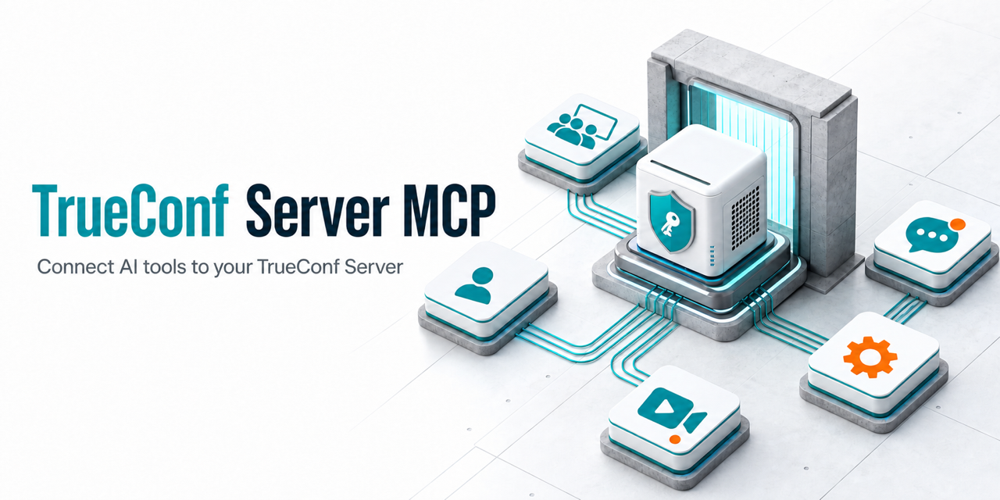
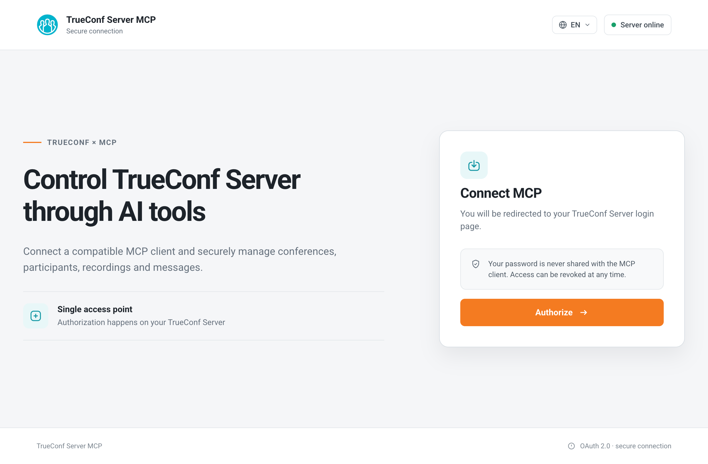
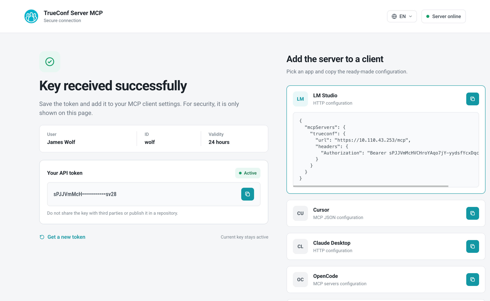

<p align="center">
  <a href="https://trueconf.com" target="_blank" rel="noopener noreferrer">
    <picture>
      <source media="(prefers-color-scheme: dark)" srcset="https://raw.githubusercontent.com/TrueConf/.github/refs/heads/main/logos/logo-dark.svg">
      
    </picture>
  </a>
</p>

<h1 align="center">TrueConf Server MCP</h1>

<p align="center">Manage TrueConf Server conferences, recordings, and invitations from any MCP client, including LM Studio, Cursor, Claude Desktop, and others.</p>

<p align="center">
  <a href="https://pypi.org/project/trueconf-server-mcp" target="_blank">
    
  </a>
</p>

<p align="center">
  
</p>

<p align="center">
  <a href="README.md">English</a> /
  <a href="./README-ru.md">Русский</a>
</p>

> [!CAUTION]
> These instructions apply to TrueConf Server 5.5.3 and later.
> If you are running an earlier version, [update your server](https://trueconf.com/products/server/howto-update-trueconf-server.html).

---

## Introduction

[**Model Context Protocol (MCP)**](https://modelcontextprotocol.io) is an open standard that allows large language models (LLMs) to invoke external tools through a unified protocol. Without MCP, every LLM client would require a separate TrueConf Server API integration. With MCP, a single server exposes all tools, and any compatible MCP client can immediately use them to create conferences, manage invitations, and access recordings and chats.

**TrueConf Server MCP** is an intermediary between an LLM client and TrueConf Server. It provides 32 tools for working with conferences, recordings, invitations, participants, chats, calendars, notifications, and translations.

### Server capabilities

| Group | Tools |
|---|---|
| **Conferences** | Create, edit, delete, start, stop, and join conferences |
| **Invitations** | List, add, delete, update, and send invitations in bulk |
| **Participants** | List participants, retrieve the owner, and retrieve the current user |
| **Recordings** | List, view, start, stop, and pause recordings |
| **Links and calendars** | Deep links, shared links, ICS files, and calendars |
| **Notifications and registration** | Send notifications and register for conferences |

---

## Quick start

1. **Install** the MCP server. → [Step 1](#step-1--installation)
2. **Create an OAuth application** on TrueConf Server. → [Step 2](#step-2--create-an-oauth-application)
3. **Start** the MCP server. → [Step 3](#step-3--start-the-server)
4. **Sign in** and obtain a token. → [Step 4](#step-4--authentication)
5. **Connect an MCP client** such as LM Studio or Cursor. → [Step 5](#step-5--connect-an-mcp-client)
6. **Verify** the connection. → [Step 6](#step-6--verify-the-connection)

### Step 1 — Installation

```bash
pip install trueconf-server-mcp
```

> [!TIP]
> If you have [uv](https://docs.astral.sh/uv/) installed, you can run the server without installing it:
> ```bash
> uvx run trueconf-server-mcp --server 10.0.0.1 --client-id ... --client-secret ...
> ```

### Step 2 — Create an OAuth application

The MCP server requires the `client_id` and `client_secret` of an OAuth application configured on TrueConf Server.

1. Open the TrueConf Server control panel and go to **Web → Security → OAuth 2.0**.
   For details, see the [documentation](https://trueconf.com/docs/server/en/admin/api#create-oauth2-application).
2. Create an application and specify the following **redirect_uri**:

   ```
   http://localhost:8080/auth/callback
   ```

   > [!IMPORTANT]
   > The redirect URI must equal `MCP_BASE_URL` followed by `/auth/callback`. If you use another host or port, update it accordingly. See [MCP_BASE_URL](#mcp_base_url).

3. Enable the **scopes** required by the tools:

   | Scope | Description |
   |---|---|
   | `conferences:read` | Read conferences, deep links, shared links, calendars, and translations |
   | `conferences:write` | Create, edit, delete, start, stop, and join conferences |
   | `conferences.invitations:read` | Read invitations |
   | `conferences.invitations:write` | Add, edit, delete, and send invitations; send notifications; register users |
   | `conferences.participants:read` | Read participants, the conference owner, and the current user |
   | `conferences.records:read` | Read recordings |
   | `conferences.records:write` | Start, stop, and pause recordings |
   | `conferences.messages:read` | Read and export chat messages |

4. Copy the `client_id` and `client_secret`. You will need them in the next step.

### Step 3 — Start the server

```bash
trueconf-server-mcp \
  --no-tls --port 8080 \
  --server 10.0.0.1 \
  --client-id <client_id> \
  --client-secret <client_secret>
```

Where:

- `--server` is the IP address or domain name of TrueConf Server.
- `--client-id` and `--client-secret` are the OAuth application credentials from step 2.
- `--no-tls --port 8080` starts the server without TLS on port 8080 for initial setup and testing.

> [!TIP]
> The `--no-tls` option transmits the bearer token without encryption. Use it **only for initial setup and testing**.
>
> For production, start the server without `--no-tls`. A self-signed TLS certificate will be generated automatically, and the server will listen on port 443. If your LLM client does not trust self-signed certificates, you can either:
>
> - [configure your own certificate](#tls-for-production), such as a Let's Encrypt certificate;
> - [disable certificate validation in the client](#lm-studio-with-a-self-signed-certificate), as shown for LM Studio.

> [!CAUTION]
> Ports **80** and **443** are privileged ports. To use them:
>
> | OS | Action |
> |---|---|
> | **macOS** | Binding to `0.0.0.0:80` or `0.0.0.0:443` works without root privileges |
> | **Linux** | Run `sudo setcap cap_net_bind_service+ep $(which trueconf-server-mcp)` or start the server with `sudo` |
> | **Windows** | Run the application as Administrator (UAC) |
>
> If you do not have the required permissions, use `--port 8080` or another port above 1024.

### Step 4 — Authentication

1. Open `http://localhost:8080/` in your browser. Click **Sign in** to open the TrueConf Server authentication page.

   <p align="center">
     
   </p>

2. Enter your TrueConf Server credentials and grant access.

3. After successful authentication, you will be redirected to `/success`, which displays your token and ready-to-use MCP client configurations.

   <p align="center">
     
   </p>

4. Copy the token. You will need it to connect your MCP client.

> [!NOTE]
> The token is valid for 24 hours by default. You can change this using `--api-token-ttl`. After the token expires, sign in again at `http://localhost:8080/`.

### Step 5 — Connect an MCP client

Copy the configuration for your client from the `/success` page or create it manually. Example for **LM Studio**:

```json
{
  "mcpServers": {
    "trueconf": {
      "url": "http://localhost:8080/mcp",
      "headers": {
        "Authorization": "Bearer <your_token>"
      }
    }
  }
}
```

Ready-to-use configurations for Cursor, Claude Desktop, OpenCode, and OpenWebUI are available in [MCP clients](#mcp-clients).

### Step 6 — Verify the connection

Open your LLM client and ask:

> Show my scheduled conferences

The LLM will invoke the `list_conferences` tool and return your conference list from TrueConf Server.

---

## Configuration

### Configuration precedence

Settings are applied in the following order, from highest to lowest priority:

1. **CLI options** — `--server`, `--port`, `--no-tls`, etc.
2. **Environment variables** — `TRUECONF_SERVER`, `TRUECONF_MCP_PORT`, etc.
3. **The `.env` file** — loaded with [python-dotenv](https://github.com/theskumar/python-dotenv)
4. **Defaults** — built-in values

### Options

| Option | Environment variable | Default | Description |
|---|---|---|---|
| `--server` | `TRUECONF_SERVER` | *(required)* | TrueConf Server host (IP address or FQDN) |
| `--client-id` | `TRUECONF_CLIENT_ID` | *(required)* | OAuth client ID |
| `--client-secret` | `TRUECONF_SECRET` | *(required)* | OAuth client secret |
| `--verify-ssl` / `--no-verify-ssl` | `TRUECONF_VERIFY_SSL` | `verify-ssl` | Verify the TrueConf Server TLS certificate |
| `--base-url` | `MCP_BASE_URL` | `https://localhost` | Public MCP server URL; it must be reachable by MCP clients |
| `--port` | `TRUECONF_MCP_PORT` | `443` (`80` with `--no-tls`) | Server port |
| `--no-tls` | `MCP_NO_TLS` | `false` | Disable TLS and use plain HTTP; changes the default port to 80 |
| `--tls-cert` | `MCP_TLS_CERT` | *(generated automatically)* | Path to a PEM certificate; requires `--tls-key` |
| `--tls-key` | `MCP_TLS_KEY` | *(generated automatically)* | Path to a PEM private key; requires `--tls-cert` |
| `--discovery-mode` | `DISCOVERY_MODE` | `static` | Tool discovery mode: `static`, `bm25`, or `code` |
| `--auth-mode` | `AUTH_MODE` | `token` | Authentication mode: `token` (manual token) |
| `--api-token-ttl` | `API_TOKEN_TTL` | `86400` | Token TTL in seconds |
| `--http-timeout` | `HTTP_TIMEOUT` | `30.0` | TrueConf API request timeout in seconds |

### Command-line help

```bash
trueconf-server-mcp --help
```

### The `.env` file

Instead of passing configuration through CLI options, you can create a `.env` file in the working directory. See [`.env.example`](.env.example):

```bash
TRUECONF_SERVER=10.0.0.1
TRUECONF_CLIENT_ID=your_client_id
TRUECONF_SECRET=your_client_secret
TRUECONF_VERIFY_SSL=false
MCP_BASE_URL=http://localhost:8080
MCP_NO_TLS=true
TRUECONF_MCP_PORT=8080
```

```bash
trueconf-server-mcp
```

---

## TLS for production

By default, when `--no-tls` is not specified, the server listens on `https://0.0.0.0:443` using an **automatically generated self-signed certificate**. On macOS, the certificate is stored in `~/Library/Application Support/fastmcp/tls/` and reused across restarts.

### Custom certificate

To use a trusted certificate, such as one issued by Let's Encrypt:

```bash
trueconf-server-mcp \
  --server 10.0.0.1 \
  --client-id <client_id> \
  --client-secret <client_secret> \
  --tls-cert /path/to/cert.pem \
  --tls-key /path/to/key.pem
```

> [!IMPORTANT]
> `--tls-cert` and `--tls-key` must be specified together.

### LM Studio with a self-signed certificate

LM Studio is based on Node.js and does not trust self-signed certificates. If the following error occurs while connecting:

> TypeError: fetch failed: self-signed certificate

Start LM Studio with TLS validation disabled:

<details>
<summary><b>macOS</b></summary>

```bash
NODE_TLS_REJECT_UNAUTHORIZED=0 open "/Applications/LM Studio.app"
```

</details>

<details>
<summary><b>Windows (Command Prompt)</b></summary>

```cmd
set NODE_TLS_REJECT_UNAUTHORIZED=0
start "" "C:\Program Files\LM Studio\LM Studio.exe"
```

</details>

<details>
<summary><b>Linux</b></summary>

```bash
NODE_TLS_REJECT_UNAUTHORIZED=0 lm-studio
```

</details>

> [!WARNING]
> `NODE_TLS_REJECT_UNAUTHORIZED=0` disables certificate verification for **all** HTTPS requests made by the LM Studio process. Use it only for local development. In production, configure a trusted certificate with `--tls-cert` and `--tls-key`.

### MCP_BASE_URL

`MCP_BASE_URL` defines the URL MCP clients use to reach the server. It is included in OAuth metadata and must be **externally reachable** by your clients.

| Scenario | `MCP_BASE_URL` |
|---|---|
| Local use (localhost only) | `https://localhost` (default; port 443 is omitted) |
| LAN (other devices on the network) | `https://<LAN-IP>` (port 443 is omitted) |
| With `--no-tls` | `http://localhost:8080` (the port is specified explicitly) |

> [!CAUTION]
> Do not use `127.0.0.1` in `MCP_BASE_URL` if the MCP client runs on another machine; it will not be able to reach the server.

---

## MCP clients

The server is compatible with any MCP client that supports HTTP transport with bearer authentication. Ready-to-use configurations are available on the `/success` page after authentication.

### LM Studio

```json
{
  "mcpServers": {
    "trueconf": {
      "url": "http://localhost:8080/mcp",
      "headers": {
        "Authorization": "Bearer <your_token>"
      }
    }
  }
}
```

> [!NOTE]
> LM Studio does not trust self-signed certificates. See [TLS](#lm-studio-with-a-self-signed-certificate).

### Cursor

```json
{
  "mcpServers": {
    "trueconf": {
      "url": "http://localhost:8080/mcp",
      "headers": {
        "Authorization": "Bearer <your_token>"
      }
    }
  }
}
```

### Claude Desktop

```json
{
  "mcpServers": {
    "trueconf": {
      "type": "http",
      "url": "http://localhost:8080/mcp",
      "headers": {
        "Authorization": "Bearer <your_token>"
      }
    }
  }
}
```

### OpenCode

```json
{
  "mcp": {
    "servers": {
      "trueconf": {
        "url": "http://localhost:8080/mcp",
        "transport": "http",
        "headers": {
          "Authorization": "Bearer <your_token>"
        }
      }
    }
  }
}
```

### OpenWebUI

```
URL:       http://localhost:8080/mcp
Header:    Authorization: Bearer <your_token>
```

---

## Tool discovery modes

The `--discovery-mode` option controls how the MCP client sees the server tools:

| Mode | Description |
|---|---|
| `static` *(default)* | All 32 tools are exposed directly. Recommended for most use cases. |
| `bm25` | Tools are hidden behind a search gateway. The LLM searches for an appropriate tool by its description, reducing context usage when many tools are available. |
| `code` | CodeMode sandbox. Tools are available through a code sandbox for complex workflows. |

```bash
trueconf-server-mcp --discovery-mode bm25 --server ... --client-id ... --client-secret ...
```

---

## Troubleshooting

| Problem | What to check |
|---|---|
| **“Plugin process exited”** or the MCP client cannot connect | Make sure `MCP_BASE_URL` is reachable from the machine running the client. Do not use `127.0.0.1` for remote clients |
| **“self-signed certificate”** in LM Studio | Start LM Studio with `NODE_TLS_REJECT_UNAUTHORIZED=0` (see [TLS](#lm-studio-with-a-self-signed-certificate)) or configure a trusted certificate with `--tls-cert` and `--tls-key` |
| **401 Unauthorized** in the MCP client | Make sure the token was copied correctly and has not expired. Its default TTL is 24 hours. Sign in again at `http://localhost:8080/` |
| **403 Forbidden** for a specific tool | The TrueConf Server OAuth application is missing the required [scope](#step-2--create-an-oauth-application) |
| **Permission denied** when binding to port 80 or 443 | See the [Quick start table](#step-3--start-the-server), or use `--port 8080` |
| **Missing required configuration** at startup | Supply `--server`, `--client-id`, and `--client-secret` through CLI options, environment variables, or a `.env` file |

If the problem persists, contact [TrueConf technical support](https://trueconf.com/support/).

---

## Links

- [TrueConf Server API documentation](https://trueconf.com/docs/server/en/admin/api/)
- [Model Context Protocol](https://modelcontextprotocol.io)
- [TrueConf technical support](https://trueconf.com/support/)
